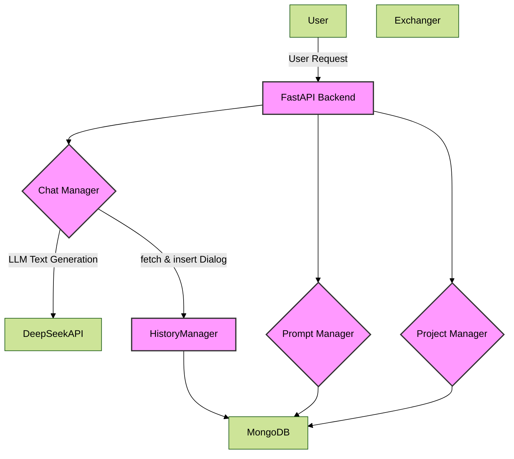
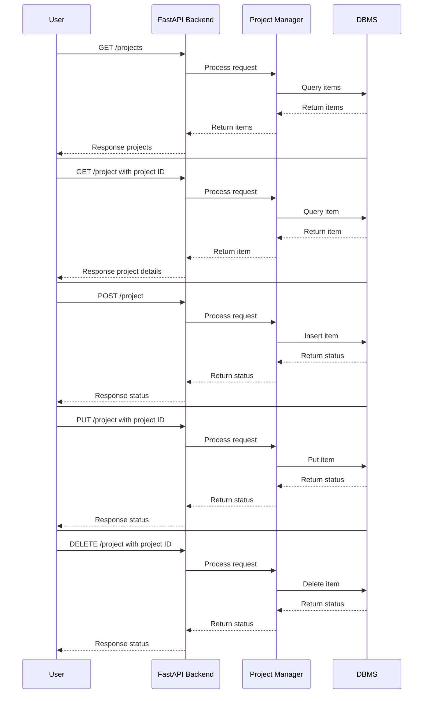
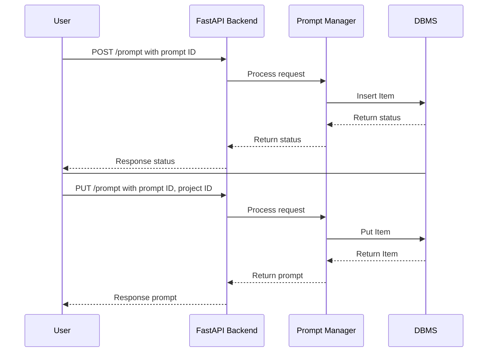
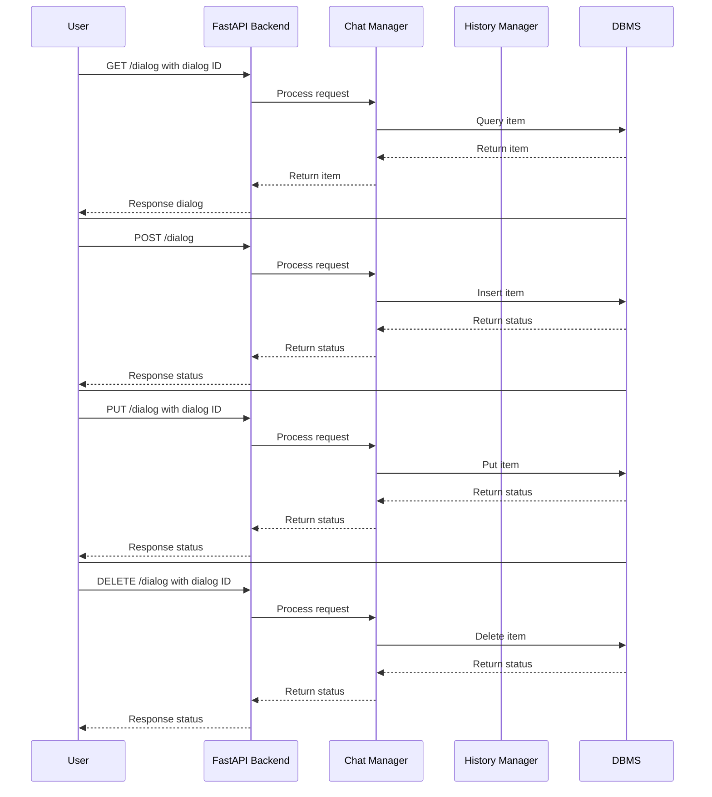
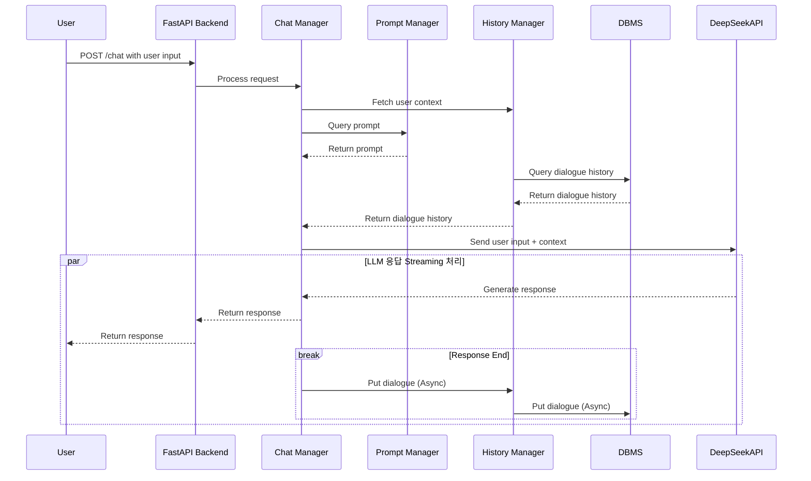

# Better-Assistant (Backend)

## 프로젝트 개요
Better-Assistant의 백엔드 시스템은 프로젝트별로 다양한 Prompt를 관리하고 실행하며, 사용자 맞춤형 테스트 환경을 제공합니다. FastAPI를 기반으로 LLM API와 통합되어 사용자의 입력에 대한 응답을 생성합니다.

---

## 주요 기능
1. **Prompt 관리**
   - 프로젝트별 Prompt 생성, 수정, 삭제
   - Prompt의 버전 관리 및 카테고리/태그 설정

2. **Prompt 실행**
   - 사용자 입력과 Prompt를 조합하여 LLM API 호출
   - 실행 결과를 데이터베이스에 저장

3. **데이터 관리**
   - MongoDB를 사용하여 Prompt 및 실행 결과 저장

---

## 기술 스택
- **프레임워크:** FastAPI (Python 3.11)
- **웹 서버:** Uvicorn
- **데이터베이스:** MongoDB
- **AI API:** DeepSeek API
- **배포 도구:** Docker, Kubernetes (NCP)
- **패키지 매니저:** uv
---

## 설치 및 실행

### 1. 환경 설정
프로젝트 실행 전 `.env` 파일에 다음 환경 변수를 설정하세요:
```
API_KEY=<DeepSeek API Key>
```

### 2. 로컬 실행
의존성 설치
```bash
uv install
```
서버 실행
```bash
uv run uvicorn main:app --reload
```

## 프로젝트 구조
```MarkDown
better-assistant-be
├── .env.example         # 환경 변수 예시 파일
├── .gitignore           # Git에서 무시할 파일 및 폴더 목록
├── Dockerfile           # Docker 이미지 빌드 설정 파일
├── README.md            # 프로젝트 설명 파일
├── pyproject.toml       # uv 패키지 관리 파일
├── uv.lock              # uv lock 파일
├── main.py              # fastapi 서버 실행 코드
├── better_assistant/    # 소스 코드 디렉토리
│   ├── exceptions.py    # excetion
│   ├── managers/        # 메인 동작 코드
│   │   ├── __init__.py  # 매니저 패키지 초기화
│   │   └── history.py   # History 매니저
│   ├── models/          # 데이터 모델 정의
│   │   ├── __init__.py  # 모델 패키지 초기화
│   │   ├── general.py   # 공통 데이터 모델
│   │   ├── response.py  # Response 데이터 모델
│   │   └── requests.py  # Request 데이터 모델
│   ├── services/        # 비즈니스 로직 구현
│   │   ├── __init__.py  # 서비스 패키지 초기화
│   │   ├── project.py   # Project 관리 서비스
│   │   ├── prompt.py    # Prompt 관리 서비스
│   │   ├── chat.py      # Chat 관리 서비스
│   │   └── generate.py  # Generate 실행 서비스
│   └── utils/           # 유틸리티 모듈
│       ├── __init__.py  # 유틸리티 패키지 초기화
│       └── mongo.py     # MongoDB 클라이언트 설정
└── tests/               # 테스트 디렉토리
    ├── __init__.py      # 테스트 패키지 초기화
    ├── test_prompts.py  # Prompt 관련 테스트
    └── test_projects.py # Project 관련 테스트
```

## Diagrams

### Service Architecture 


### Sequence Diagram

#### Project


#### Prompt


#### Chat


#### Generate

